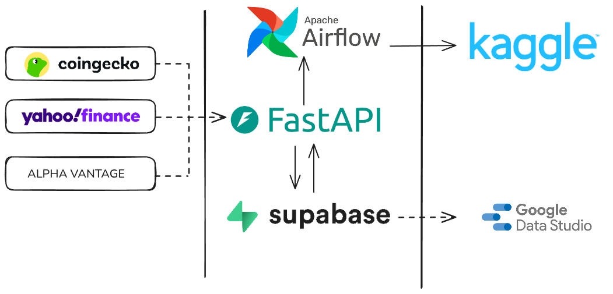

<h1 align="center">StateWatch</h1>

<h3 align="center">A simple data pipeline for keeping up with the state of the world economy.</h3>

---

StateWatch is a simple data pipeline to gather financial data from multiple APIs. The chosen financial assets that I keep track of in this project are the main metrics that I follow for market signals. As such, this entire project is opinionated.

# Data Pipeline

We gather data from 3 different sources to leverage free demos and access. The FastAPI backend feature the endpoints that run scripts for daily price updates on protected endpoints such as `/tasks`. These endpoints are called daily using Cron jobs, which is a built-in feature by our FastAPI host, Vercel.

All data is stored on a PostgreSQL database hosted for free by Supabase. Once data is available, the Google Data Studio [dashboards](https://datastudio.google.com/reporting/5a683a41-92af-4ec0-9fb3-8b4fe1103c89) are hydrated using table views defined within the database.
